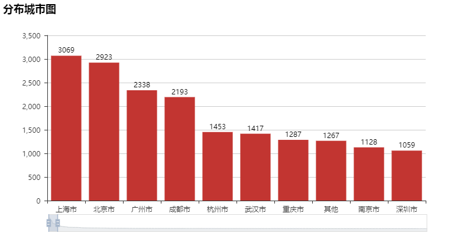
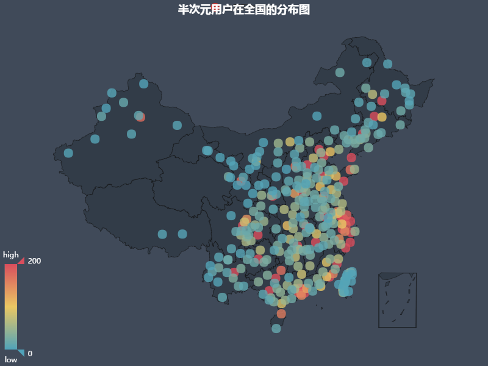
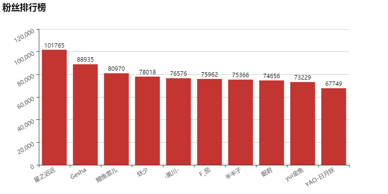
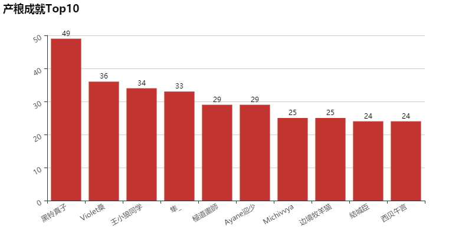
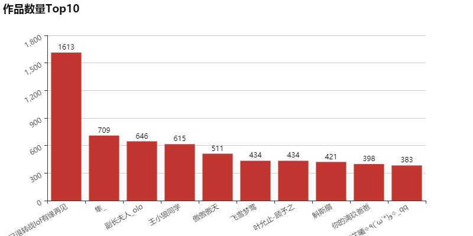

**这是半次元 https://bcy.net 一个全站作品图片采集爬虫, 支持分布式运行**

**只要账号不被禁用 IP不被BAN 可自动更新Cookie**

**更改config.py中的配置即可**

**更改settings.py中的redis链接**

**根据系统情况更换Chromedrive.exe版本**

**cd bcy/bcy**

**python run.py**

------------
###哪些城市二次元人数最多？越有钱的地方大家越喜欢二次元

###都来自全国哪些地方？再次说明了越富裕的地方二次元受众越多（顺便一提还有好多国外的小伙伴儿，可惜没有找到世界地图的图表）

###大家都喜欢什么？？（VOVALOID遥遥领先啊！）

###大家都给自己什么定位？？（萝莉赛高！）

###谁最受欢迎？（星之迟迟 的确是好看啊！啧啧）

###获奖狂魔：

###作品狂魔（全是小说）：

####ipynb文件表生成依赖于pyecharts